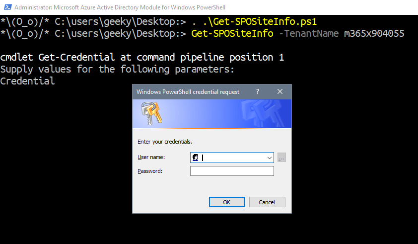
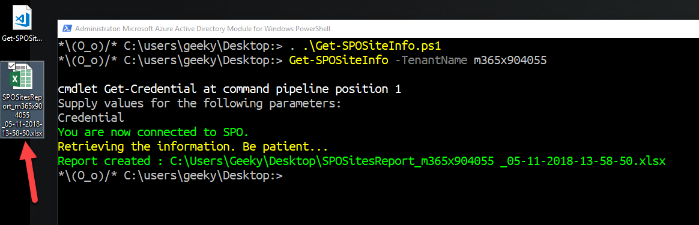

## What's needed to run the function

The script uses [SharePoint PowerShell PnP] (https://github.com/SharePoint/PnP-PowerShell) *(Patterns & Practices)*.

Therefore, this is a requirement for the script to run.

## How to use Get-SPOSiteInfo.ps1

1. Navigate where you saved the script
2. Dot source the script
3. Run the function with the *-TenantName* parameter
4. Enter your O365 credentials
5. Locate the report (*.xlsx file*) on the desktop

